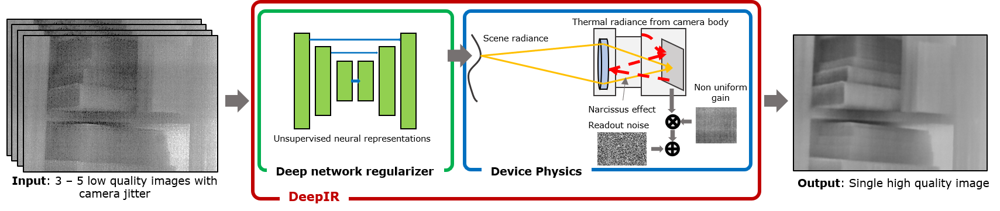

# DeepIR
Deep InfraRed image processing framework



## Synopsis
Thermal images captured by uncooled microbolometer cameras suffer from non-uniform noise that leads to severe loss in spatial resolution. We identify that thermal images can be factored into a scene-dependent flux that is concisely modeled as outputs of deep networks, and a scene-independent and slowly varying non-uniformity. By capturing multiple images with small camera motion, we are able to estimate the high quality thermal image. 

## Paper
[arXiv paper link](https://arxiv.org/abs/2108.07973)

## Requirements
See `requirements.txt`.

Parts of `modules/thermal.py` have been changed due to API changes in `kornia` library.

## Usage
- If you want to run on simulated images, we have included two Boson images in the `data/` folder.
- If you want to run on a sequence of real images, please download the data from the link given in the next section and place the folders `boson` and `lepton` in `data/` folder.
- Once you downloaded the data, open `demo.py` and change the relevant variables -- all information should be available as comments. For example, if you want to run a simulation, the set of variables should be:
```python
imname = 'test1'
camera = 'sim'
scale_sr = 1        # Set scale to 1 for denoising, higher integers
                    # for super resolution
nimg = 5            # Number of input images. For denoising, 3 - 5 suffice,
                    # but for super resolution, you may need more.
method = 'dip'      # 'dip' for DeepIR and 'cvx' for a variant of Hardie et al. with convex optimization
````
- We have provided default configuration files in `configs/`, you may edit them as you see fit.

## Real data
Download image sequences from real camera [here](https://drive.google.com/drive/folders/10hV5YeqN6tyI8nfANiXiT9VGHImuYL0B?usp=sharing)

The data folder contains mat files from a Boson camera (640x512) and a Lepton 3.5 camera (160x120). Each image sequence was captured with small amounts of camera motion that can be modeled as affine transformation. 

## Citation
```
Vishwanath Saragadam, Akshat Dave, Ashok Veeraraghavan, and Richard G. Baraniuk, "Thermal Image Processing via Physics-Inspired Deep Networks", IEEE Intl. Conf. Computer Vision Workshop on Learning for Computational Imaging, 2021.
```

## Acknowledgements
We thank the authors of Deep Image Prior for sharing their [code](https://github.com/DmitryUlyanov/deep-image-prior). We repurposed some of their code for DeepIR.